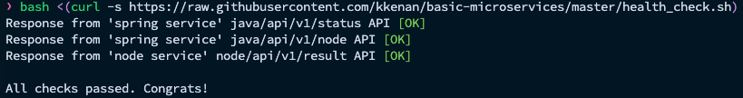

# Basic Microservices Deployment with Docker Compose

This setup runs three services:
1. **PostgreSQL** (v10) for database storage.
2. **Spring Boot App** (Java backend) on port 8080.
3. **Node.js App** (Frontend) on port 3000.

## Prerequisites
- Docker and Docker Compose installed.

## Instructions

1. **Clone this repository** (contains the Dockerfiles and `docker-compose.yml`).

3. **Change to the directory where the repository was cloned**
   ```bash
   cd dockerized-basic-microservices
   ```

4. **Start all services**:
   ```bash
   docker-compose up -d
   ```

5. **To ensure everything is running smoothly, execute the following command to     perform a health check:** (execute bash command)
   ```bash
   bash <(curl -s https://raw.githubusercontent.com/kkenan/basic-microservices/master/health_check.sh) 
   ```

   The expected output should look like this:

   